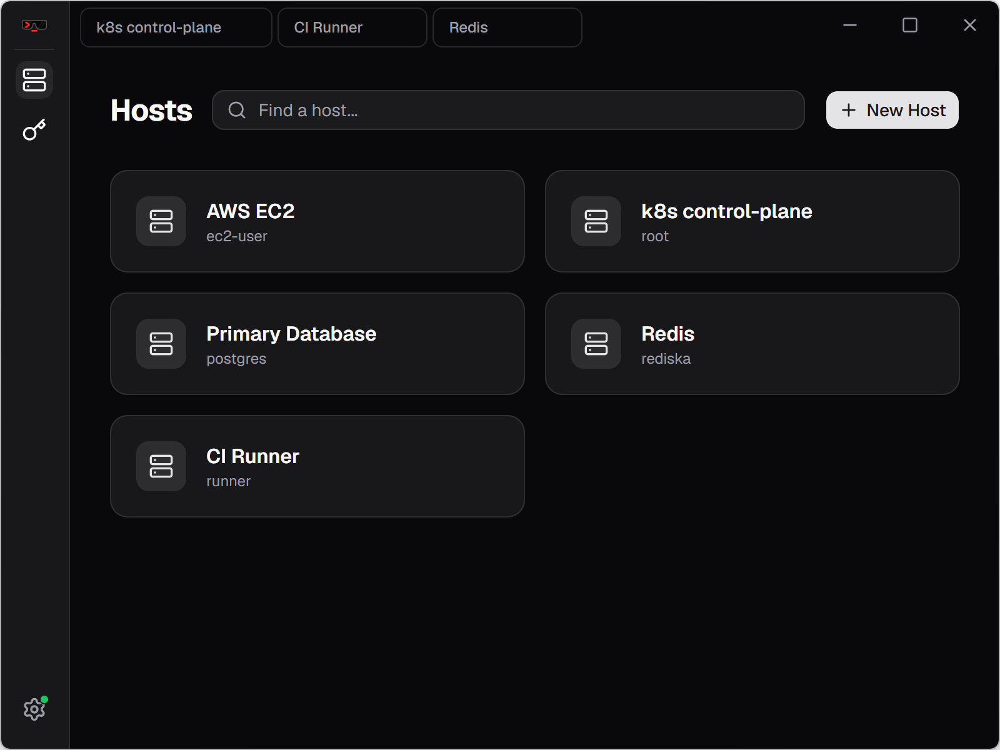
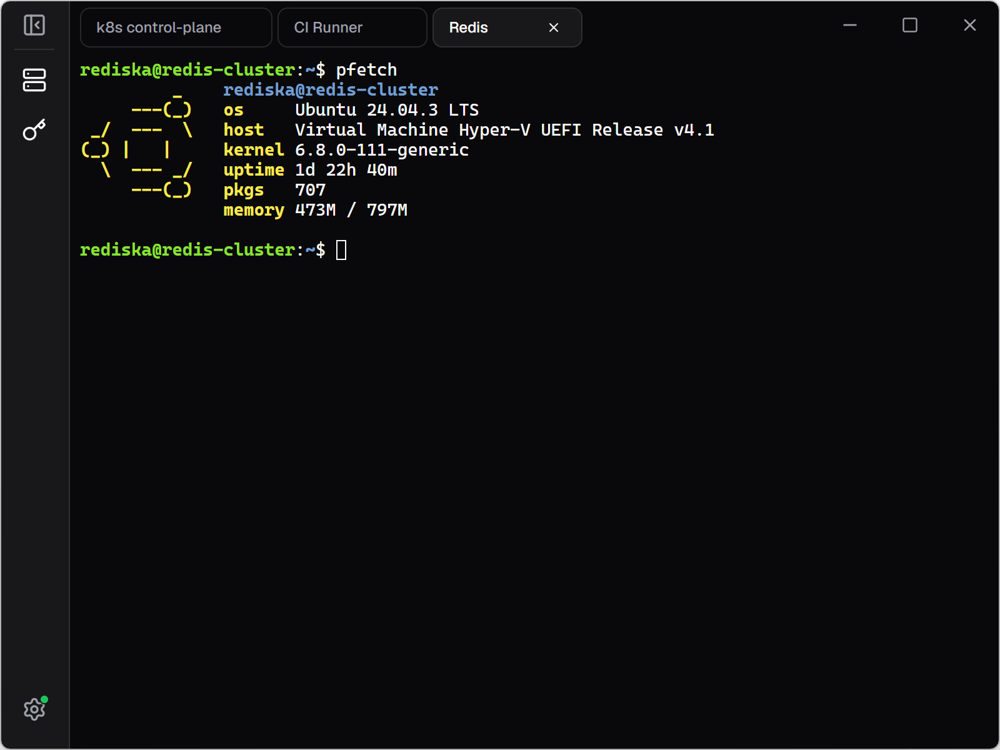

<h1 align="center">

Terminator

   

</h1>

<h3 align="center">

Self-hostable SSH client with sync

</h3>

Terminator is a cross-platform SSH client built with [Wails v3](https://v3.wails.io/) and Go. Supports self-hosted servers for sync.

## Features

- **Encryption.** All sensitive data is encrypted locally using Argon2id and AES-256-GCM.
- **Sync** encrypted data across multiple devices. Data is encrypted *before* it leaves the client!
- **Dark/Light themes.** Built-in Abyss (dark) and Frost (light) themes, switchable anytime in settings.
- **Lightweight.** ~15MB binaries, ~10MB RAM.
- Cross-platform:
  - [Windows](https://github.com/YCJE/Terminator/releases/latest/download/terminator-amd64-installer.exe)
  - [Linux](https://github.com/terminator-ssh/terminator-desktop/releases/latest/download/Terminator-linux-stable.AppImage)
  - [MacOS](https://github.com/terminator-ssh/terminator-desktop/releases/latest/download/Terminator-macos-stable-Setup.pkg)
- Local first. You *don't have to* use a server!

## Server

Terminator is designed as a local-first app, but it supports E2E encrypted sync. Grab the server [here](https://github.com/terminator-ssh/terminator-server)!

After connecting to a cloud server, you can disconnect anytime in settings. Local data stays intact.

## Roadmap

- [x] Encryption
- [x] Sync
- [x] SSH keys
- [x] Dark/Light theme switcher
- [x] Chinese default on first launch
- [ ] Host groups
- [ ] Interactive passwords
- [ ] Multiple profiles (teams?)
- [ ] Shortcuts
- [ ] Android client
- [ ] CLI client
- [ ] SFTP

Something missing? Suggest more! [Issues](https://github.com/YCJE/Terminator/issues/new)

## Screenshots




## Development

### Prerequisites

1. [**Go**](https://go.dev/dl/) (1.25+)
2. [**Node.js**](https://nodejs.org/en/download/current) (v24+)
3. *Preferrably* [**pnpm**](https://pnpm.io/installation#using-corepack)
4. [**Wails3 CLI**](https://v3.wails.io/getting-started/installation/)

### Build

For development:
```
wails3 dev
```

Debug with [delve](https://github.com/go-delve/delve/tree/master/Documentation/installation):
```sh
dlv debug --headless --listen=:2345 ./backend/cmd/terminator-desktop -- dev
```

Package:
```
wails3 task package
```

### Acknowledgements

Inspired by: [Termius](https://termius.com)

Built on: [Wails](https://v3.wails.io)

Beautiful UI: [shadcn](https://ui.shadcn.com)

---

[中文](./README.md)
